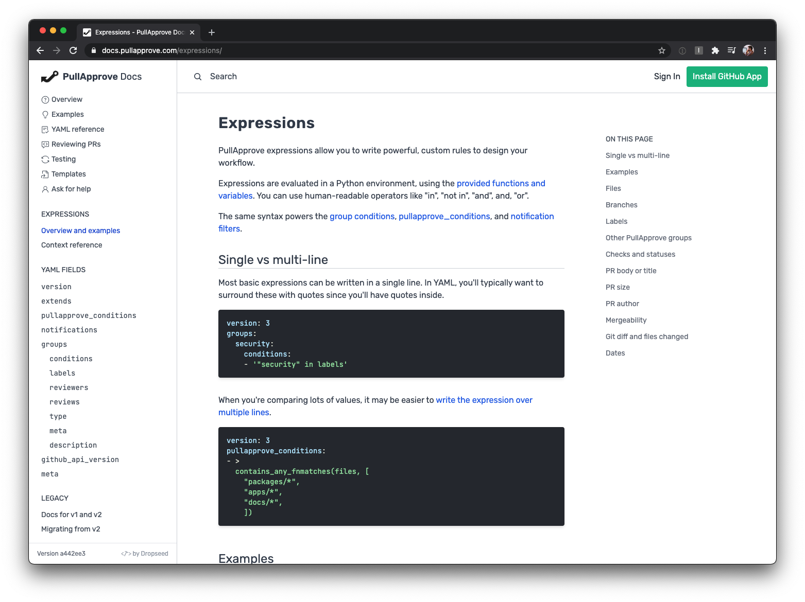

# dropseed-docs-theme

A [Combine](https://github.com/dropseed/combine) theme for standard Dropseed documentation.



This theme has:

- a fixed, full-screen layout with a sidebar
- [search with pitchfork](https://github.com/dropseed/pitchfork)
- [Tailwind](https://tailwindcss.com/)
- on-page navigation sidebar that is populated automatically
- active-page link highlighting with JavaScript
- a markdown template with optional next/previous page links
- [Rubik](https://fonts.google.com/specimen/Rubik) and [JetBrains Mono](https://fonts.google.com/specimen/JetBrains+Mono) Google Fonts
- a `google_tag_manager_id` variable
- a `version` variable
- a site `name` variable

## Using it


### Git submodule

A submodule is the recommended way to use this on Dropseed projects,
so that improvements can be pushed/pulled easily.

```console
$ git submodule add https://github.com/dropseed/dropseed-docs-theme theme
```

To pull the latest changes,
you can then do:

```console
$ git submodule update --remote theme
```

You could also do a one-time copy of these files to use as a starting point.

### `combine.yml`

Your site needs a `combine.yml`,
and the build steps are defined there.

```yaml
steps:
  - run: "./theme/node_modules/.bin/parcel build theme/content/assets/_main.js --out-dir output/assets --out-file main.js"
    watch: ["./theme/content/assets/_main.js"]
  # Note how we're using a modified copy of _main.css from the site itself, not the theme
  # (this is also run after JS so that purge uses JS too)
  - run: "./theme/node_modules/.bin/tailwind build ./content/assets/_main.css -o ./output/assets/main.css"
    watch:
      - "./tailwind.config.js"
      - "./content/assets/_main.css"
  - run: "./theme/node_modules/.bin/pitchfork index output -c .content"

variables:
  name: Combine
  base_url:
    default: "https://combine.dropseed.io"
    from_env: URL  # netlify
  version:
    default: "\"latest\""
    from_env: COMMIT_REF
  google_tag_manager_id:
    from_env: GOOGLE_TAG_MANAGER_ID
```

### `tailwind.config.js`

You can import and add/remove settings to the theme's Tailwind config:

```js
const docsTheme = require("./theme/tailwind.config.js")

docsTheme.theme.extend.colors = {
  "d-brown-100": "#fbf9f8",
  "d-brown-200": "#e1cdc0",
  "d-brown-300": "#c7b5a8",
  "d-brown-400": "#ad9c91",
  "d-brown-500": "#948479",
  "d-brown-600": "#7a6b61",
  "d-brown-700": "#60534a",
  "d-brown-800": "#463a32",
  "d-brown-900": "#252525",
  "d-green": "#6b8f71",
  "d-red": "#e15634",
}

module.exports = docsTheme
```

### `base.template.html`

Then extend the theme with your base template.

```html+jinja


text-gray-700


<a href="/" class="flex items-center no-underline md:text-lg">
    
    <span class="font-semibold">PullApprove</span>&nbsp;Docs
</a>



<div class="items-center justify-end hidden md:flex">
    <a href="https://app.pullapprove.com" class="text-gray-800 hover:text-black">Sign In</a>
    <a href="https://app.pullapprove.com"
        class="px-3 py-2 ml-3 text-white bg-green-500 rounded hover:bg-green-400">Install GitHub App</a>
</div>
<div class="flex items-center md:hidden">
    <button data-toggle-sidebar="hidden" type="button">
        <svg xmlns="http://www.w3.org/2000/svg" fill="none" viewBox="0 0 24 24" stroke="currentColor" class="w-8 h-8">
            <path stroke-linecap="round" stroke-linejoin="round" stroke-width="2" d="M4 6h16M4 12h16M4 18h16" />
        </svg>
    </button>
</div>

```
